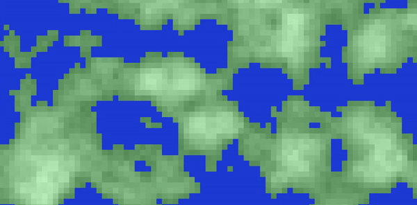

# simple-procedual-terrain-generator
### 2D procedural terrain generator in html/javascript using Perlin noise and P5.js

## How does it work
It uses randomly generated japanes-like names (with tihs [code](https://github.com/danielenapo/JapaneseNameGenerator.js)) as seed to generate a pseudo-random height map using Perlin noise.

## Implementation samples
I've implemented this generator to start making this simple procedural [game](https://github.com/danielenapo/2d-procedural-game).
